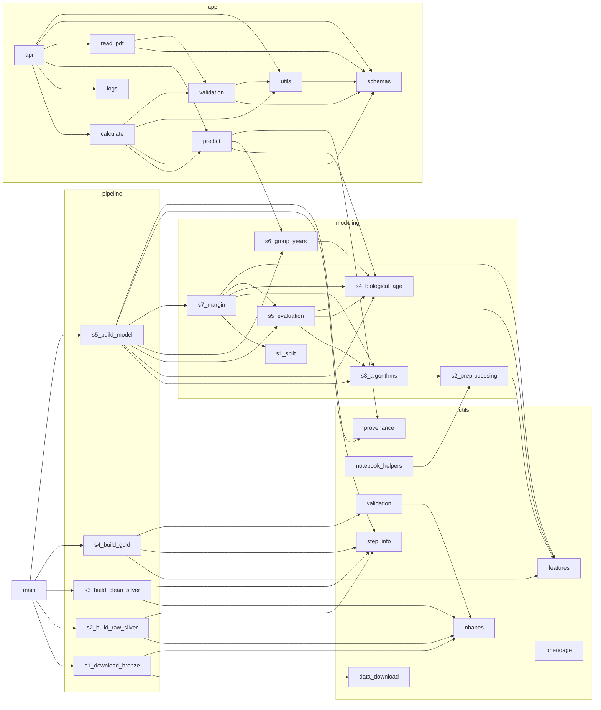

# Import graph

Which module of `src/bioage` imports which. Almost every module also reads `config/` (arrows left out).
Generated by `write_graph()` in `tests/test_import_graph.py`.

```mermaid
flowchart LR
  subgraph app
    app_api[api]
    app_calculate[calculate]
    app_logs[logs]
    app_predict[predict]
    app_read_pdf[read_pdf]
    app_schemas[schemas]
    app_utils[utils]
    app_validation[validation]
  end
  subgraph modeling
    modeling_s1_split[s1_split]
    modeling_s2_preprocessing[s2_preprocessing]
    modeling_s3_algorithms[s3_algorithms]
    modeling_s4_biological_age[s4_biological_age]
    modeling_s5_evaluation[s5_evaluation]
    modeling_s6_group_years[s6_group_years]
    modeling_s7_margin[s7_margin]
  end
  subgraph pipeline
    pipeline_s1_download_bronze[s1_download_bronze]
    pipeline_s2_build_raw_silver[s2_build_raw_silver]
    pipeline_s3_build_clean_silver[s3_build_clean_silver]
    pipeline_s4_build_gold[s4_build_gold]
    pipeline_s5_build_model[s5_build_model]
  end
  subgraph utils
    utils_data_download[data_download]
    utils_features[features]
    utils_nhanes[nhanes]
    utils_notebook_helpers[notebook_helpers]
    utils_phenoage[phenoage]
    utils_provenance[provenance]
    utils_step_info[step_info]
    utils_validation[validation]
  end
  main[main]
  app_api --> app_calculate
  app_api --> app_logs
  app_api --> app_predict
  app_api --> app_read_pdf
  app_api --> app_schemas
  app_api --> app_utils
  app_calculate --> app_predict
  app_calculate --> app_schemas
  app_calculate --> app_utils
  app_calculate --> app_validation
  app_predict --> modeling_s4_biological_age
  app_predict --> modeling_s6_group_years
  app_predict --> utils_provenance
  app_read_pdf --> app_schemas
  app_read_pdf --> app_validation
  app_utils --> app_schemas
  app_validation --> app_schemas
  app_validation --> app_utils
  main --> pipeline_s1_download_bronze
  main --> pipeline_s2_build_raw_silver
  main --> pipeline_s3_build_clean_silver
  main --> pipeline_s4_build_gold
  main --> pipeline_s5_build_model
  modeling_s2_preprocessing --> utils_features
  modeling_s3_algorithms --> modeling_s2_preprocessing
  modeling_s5_evaluation --> modeling_s3_algorithms
  modeling_s5_evaluation --> modeling_s4_biological_age
  modeling_s5_evaluation --> utils_features
  modeling_s6_group_years --> modeling_s4_biological_age
  modeling_s7_margin --> modeling_s1_split
  modeling_s7_margin --> modeling_s3_algorithms
  modeling_s7_margin --> modeling_s4_biological_age
  modeling_s7_margin --> modeling_s5_evaluation
  modeling_s7_margin --> utils_features
  pipeline_s1_download_bronze --> utils_data_download
  pipeline_s1_download_bronze --> utils_nhanes
  pipeline_s2_build_raw_silver --> utils_nhanes
  pipeline_s2_build_raw_silver --> utils_step_info
  pipeline_s3_build_clean_silver --> utils_nhanes
  pipeline_s3_build_clean_silver --> utils_step_info
  pipeline_s4_build_gold --> utils_features
  pipeline_s4_build_gold --> utils_step_info
  pipeline_s4_build_gold --> utils_validation
  pipeline_s5_build_model --> modeling_s3_algorithms
  pipeline_s5_build_model --> modeling_s4_biological_age
  pipeline_s5_build_model --> modeling_s5_evaluation
  pipeline_s5_build_model --> modeling_s6_group_years
  pipeline_s5_build_model --> modeling_s7_margin
  pipeline_s5_build_model --> utils_provenance
  pipeline_s5_build_model --> utils_step_info
  utils_notebook_helpers --> modeling_s2_preprocessing
  utils_validation --> utils_nhanes
```
